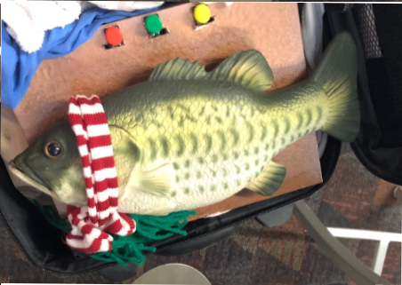

# Xmas Fish

This project contains information for using the MP3-TF-16P or similar MP3 player module.  The module, in this project, is connected to an Arduino and speaker and plays back MP3 files.  The files are stored on an SDCard that is inserted into the MP3 module.  Additionally, a set of three push buttons are connected to the Arduino which control the reverse, forward, and play/pause actions for the files.

## Architecture
The Arduino and MP3 module are stored on a simple bread board and wired together as shown.  The speaker is wired to the MP3 module's speaker outputs.  A 1000 ohm resister is inserted between the Arduino and the MP3 module as shown.   Not shown is a portable 5v power supply, just a simple $20 brick that is used to charge up  devices over the USB-C port.

The MP3 files must be named "0001.mp3", "0002.mp3", and so on and be placed at the root of the SD card.

A portable 5v power source was used for power.  All components fit inside of the mounting box shown in the photo.  A few holes were placed strategically on the box to 1) allow a user to turn on/off the power source completely and 2) insert a cable to recharge the power source.  These strategeries prevent the user from having to take everything appart to access the power source.

## Software
The system is controlled by an Arduino "sketch", `xmasfish.ino`, which basically just sets up the button I/O pins, initializes the MP3 module, and then loops, playing the files, and waiting for a button press.

It also relies on the Arduno library `DFRobotDFPlayerMini`, which can be installed via the Arduino IDE.

## Installation
1. Download this project from Github.  It should download to a directory called `xmasfish`.
2. You'll need an SDCard to store the MP3 files onto.  You can use the files in the `mp3.zip` file, but be sure to unzip them and copy to the SDCard, one at a time.
3. Install the Arduino IDE on your laptop if it is not already installed.
4. Connect the Arduino to your laptop's USB port.  This will provide power and allow you to load software to it.  You don't have to connect all of the components just yet, we first just want to make sure that the IDE and Arduino work together.
5. Run the Arudino IDE and use the "Board Manager" (this term may differ based on which version of the IDE you have installed) and choose the Arduino you are using, e.g. "Arduino Nano".  You may need to mess with the USB settings of your laptop.
6. Make sure that you can hit the Arduino using one of the Example programs, e.g. the "Blink" program which will loop and blink the Arduio on-board LED lights.  This should let you know that you at least have the Arudio working.  So from the IDE, load and then run the "Blink" example program that comes with the IDE.  You should see the LEDs blink.  Also at this time, open the "Serial Monitor" as this will be crucial for watching print statements that your Arduino sketch code will be spewing out. Don't bother going on to any other step until you can at least get the Blink sketch to work on your Arduino and can see the code run via the Serial Monitor.
7. In the IDE, find the library manager (currently under Sketch, Include Library, Manage Libraries) and find and install the DFRobotDFPlayerMini library.
8. Now wire up the components as shown in the architecture figure.
9. From the IDE, load and run the xmasfish.ino into the Arduino.
10. In the serial monitor, you should see the program try to initialize the MP3 module, start playing the first MP3 file, and loop and wait for a button press

## References
1. https://www.digikey.com/en/products/detail/dfrobot/DFR0299/6588463?gclsrc=aw.ds&&utm_adgroup=&utm_source=google&utm_medium=cpc&utm_campaign=PMax%20Shopping_Product_Low%20ROAS%20Categories&utm_term=&utm_content=&utm_id=go_cmp-20243063506_adg-_ad-__dev-c_ext-_prd-6588463_sig-Cj0KCQiA1Km7BhC9ARIsAFZfEItJ57lxwgxSVFehuAg1FEWTJUNMkW7LTwE8gCQe0X39HnHbs3dpWm8aAsRkEALw_wcB&gad_source=1&gclid=Cj0KCQiA1Km7BhC9ARIsAFZfEItJ57lxwgxSVFehuAg1FEWTJUNMkW7LTwE8gCQe0X39HnHbs3dpWm8aAsRkEALw_wcB&gclsrc=aw.ds
